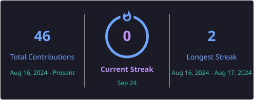

# Olá, eu sou Breno Cardoso

  

---

## Sobre mim

 Graduado em **Análise e Desenvolvimento de Sistemas** no **Centro Universitário SENAC Santo Amaro**.

 Apaixonado por desenvolvimento de software, banco de dados e qualidade de software (QA).

 Possuo conhecimentos em testes manuais e automatizados utilizando **Selenium, Cucumber, JUnit e Postman**.

 Foco em desenvolvimento Back-end com **Java**, APIs REST e banco de dados SQL.

 Atualmente busco oportunidade como **Estagiário ou QA Júnior / Desenvolvedor Júnior** para aplicar meus conhecimentos e crescer profissionalmente.

---

## Tecnologias e Ferramentas

* Selenium
* Cucumber
* JUnit
* Postman
* Testes Manuais
* Testes Funcionais
* Automação de Testes
* APIs REST

---

## Estatísticas GitHub

  

---

## Sequência de Contribuições

---

## Objetivos Profissionais

* QA Júnior

* Estágio em Qualidade de Software

* Desenvolvimento Back-end Java

* Automação de Testes

* Desenvolvimento de APIs REST

* Banco de Dados SQL

---

## Certificações e Conhecimentos

* Oracle SQL
* Banco de Dados Relacional
* Modelagem de Dados
* Java Orientado a Objetos
* Spring MVC
* JDBC
* REST API
* Selenium WebDriver
* Cucumber BDD
* JUnit
* Postman

---

## Conecte-se comigo

---

   Obrigado por visitar meu perfil!

  

